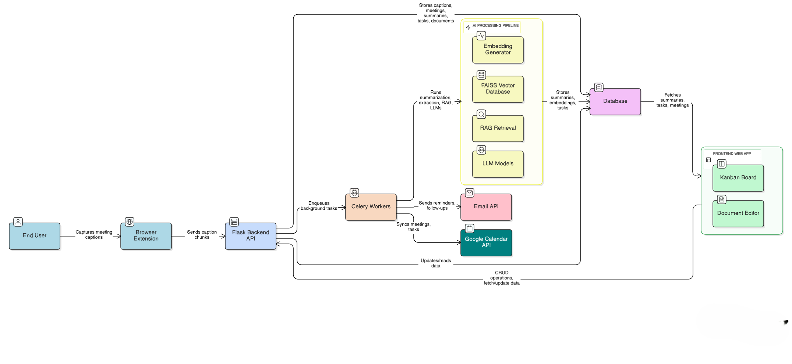

# 🚀 AutoMeet AI

### *An AI-Powered Meeting Intelligence & Automation Platform*

> **AutoMeet AI** transforms meetings from passive conversations into **actionable intelligence**.
> It captures live meeting captions, understands discussions using advanced AI, extracts action items, manages tasks, answers questions from past meetings, and automates follow-ups — all **without recording audio**.

---

## 🌟 Why AutoMeet?

Modern teams lose **critical decisions, tasks, and context** after meetings.
AutoMeet ensures **nothing gets forgotten**.

✔ No manual note-taking
✔ No missed action items
✔ No dependency on recordings
✔ Fully automated follow-ups
✔ Works across meetings, time, and teams

---

## 🧠 What Makes AutoMeet Different?

AutoMeet is built with a strong focus on privacy and real-world usability. Instead of recording audio, it works entirely on live captions, making it safe for sensitive and multilingual meetings. It doesn’t just summarize conversations—it understands them, automatically identifying decisions, tasks, owners, and deadlines. With semantic search powered by RAG and FAISS, users can instantly recall past discussions through a smart AI assistant. Built-in task management, email follow-ups, and calendar automation ensure every meeting actually leads to action, while an asynchronous, distributed backend keeps the system fast and scalable.

---

## 🏗️ System Architecture (High Level)

### Complete System Architecture


### RAG (Retrieval-Augmented Generation)


### Flask + Celery + Redis (Async Processing)


**AutoMeet follows a clean, scalable, production-grade architecture**:

```
Browser Extension
        ↓
Flask Backend (API Layer)
        ↓
Celery Workers (Async AI Engine)
        ↓
AI Models + FAISS Vector DB
        ↓
React Frontend + AI Bot
        ↓
Email & Calendar Automation
```

---

## 🔍 Core Components

---

### 🌐 Browser Extension – Live Caption Capture

**The entry point of AutoMeet AI**

**What it does**

* Captures live captions from **Google Meet / Zoom**
* Reads captions directly from the **DOM**
* Supports **any language shown on screen**
* No audio recording → **privacy-first**

**How it works**

* DOM Mutation Observers detect caption changes
* Captions are normalized, timestamped, and chunked
* Securely sent to backend APIs in real time

---

### ⚙️ Flask Backend – Control Center

**Handles orchestration, APIs, and data flow**

**Responsibilities**

* Caption ingestion & storage
* Triggering background AI jobs
* Authentication (JWT / OAuth)
* APIs for:

  * Summaries
  * Tasks (Kanban)
  * Documents
  * AI Bot queries
  * RAG search

**Design**

* SQLAlchemy ORM
* Clean controller–service–repository pattern
* Scalable & modular

---

### 🔄 Celery Worker System – Automation Engine

**Why Celery?**

> AI workloads should never block users.

**Celery handles**

* Meeting summarization
* Action-item extraction
* Embedding generation
* FAISS index updates
* Email sending
* Google Calendar sync
* Scheduled digests

**Workflow**

```
Flask → Celery Broker → Workers → DB / Email / LLMs
```

---

## 🧠 AI Intelligence Layer

---

### ✍️ AI Summarization (Flan-T5)

**Capabilities**

* Short & detailed summaries
* Identifies key discussions and decisions
* Cleans noisy conversational text

**Process**

1. Caption chunks → cleaned
2. Processed in batches
3. Context merged intelligently
4. Stored & shown in UI

---

### ✅ Action Item Extraction

**Auto-detects tasks discussed in meetings**

**Outputs**

* Task description
* Owner
* Due date
* Priority
* Confidence score

**Tech**

* Flan-T5 (semantic understanding)
* spaCy (NER for names)
* Dateparser (deadline extraction)
* Structured JSON storage

---

### 🔎 RAG + Semantic Search (FAISS)

**Ask questions like**

* *“What decisions did we take last Friday?”*
* *“Summarize everything about Project Alpha.”*
* *“What tasks were assigned to John?”*

**How it works**

1. Transcript → embeddings
2. Stored in **FAISS vector DB**
3. Query → embedding → nearest context
4. Context → LLM → grounded answer

---

### 🤖 AutoMeet AI Bot – Meeting Memory Engine

**Not a chatbot. A meeting expert.**

**Can**

* Answer questions across meetings
* Explain why a task was assigned
* Summarize discussions instantly
* Retrieve past decisions with context

**Powered by**

* LangChain (orchestration)
* RAG pipelines
* Memory management
* Multi-LLM routing

**Supported LLMs**

* Gemini Pro
* ChatGPT-4.0
* LLaMA
* Groq
* Claude

---

## 📋 Productivity Layer

---

### 🧩 Kanban Board (Task Management)

* AI-generated tasks auto-appear
* Drag-and-drop workflow
* Status: *To-Do → In Progress → Done*
* Fully editable & persistent

---

### 📝 Document Editor

**Rich-text collaborative workspace**

Use it for:

* Meeting notes
* Project documentation
* Brainstorming
* Reports

**Features**

* Formatting & hyperlinks
* Auto-save
* Linked to meetings & summaries

---

## 📧 Automation & Integrations

### ✉️ Email Automation

* Meeting summaries
* Action-item reminders
* Follow-up emails

### 📆 Google Calendar Integration

* Detect meeting completion
* Sync follow-ups
* Add reminders automatically

---

## 🔁 End-to-End Workflow

```
1. Meeting starts
2. Extension captures captions
3. Backend stores data
4. Celery runs AI pipelines
5. FAISS indexes knowledge
6. Frontend updates summaries & tasks
7. AI Bot answers questions
8. Emails & calendar updates sent
```

---

## ⚙️ Tech Stack

| Category        | Technologies Used |
|-----------------|------------------|
| **Frontend**    | React, Tailwind CSS |
| **Backend**     | Flask, Celery, SQLAlchemy |
| **AI / NLP**    | Flan-T5, LangChain, RAG, FAISS, spaCy, Dateparser |
| **LLMs**        | GPT-4, Gemini Pro, LLaMA, Claude, Groq |
| **Integrations**| Google Calendar API, Email APIs |


## 👨‍💻 Author

**Sai Manikanta Patro**
B.Tech CSE | B.Sc Data Science
AI • GenAI • RAG • Systems Engineering

> *“Meetings shouldn’t end with confusion. They should end with clarity.”*

---

## ⭐ Final Note

If you found this project interesting:
**Star ⭐ the repo, fork it, or build on top of it.**
AutoMeet AI is built to scale — both technically and impact-wise.

---

If you want next:

* 🔥 **Enterprise-grade README (startup pitch style)**
* 📄 **Research-paper-ready system description**
* 🎯 **Recruiter-optimized project explanation**
* 🧠 **Architecture diagram prompts**
* 📦 **Deployment & setup README**

Just tell me.
